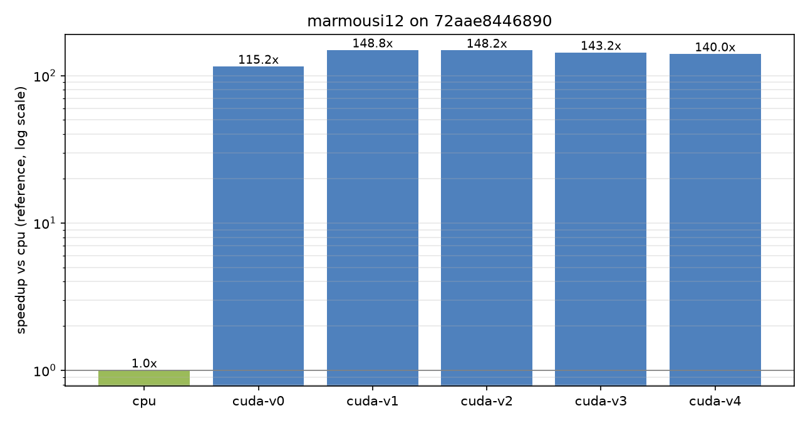
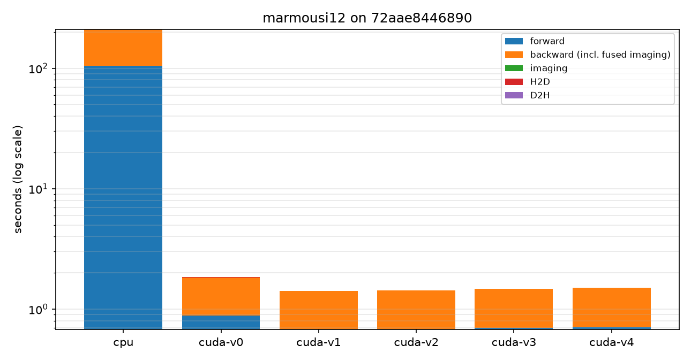
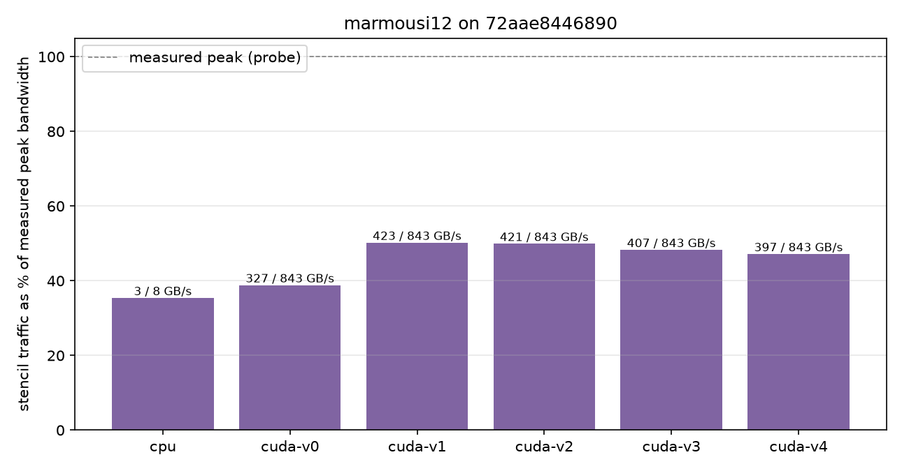
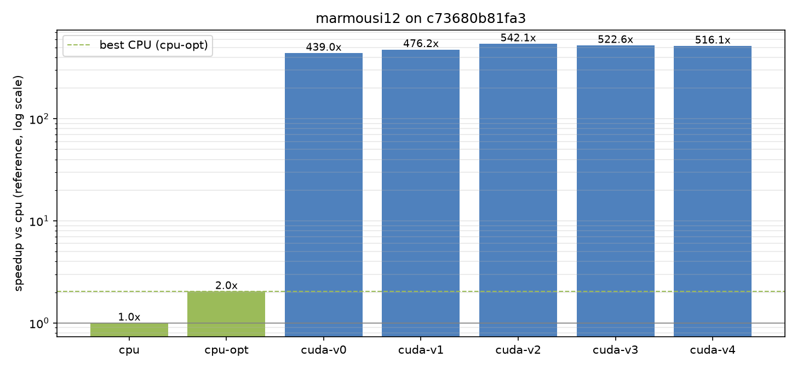
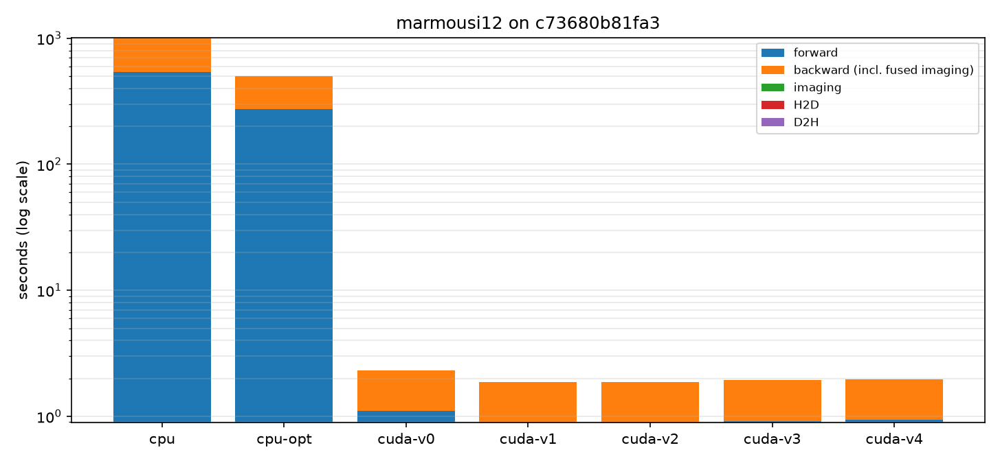
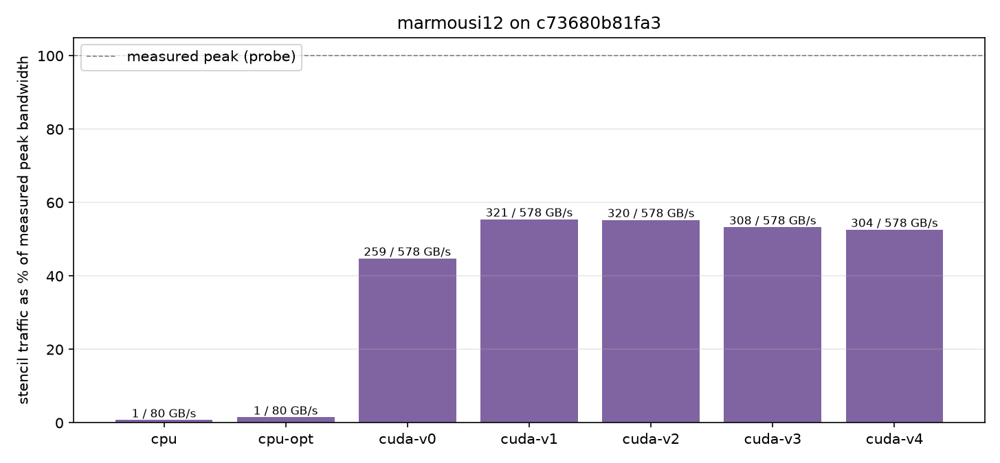

# Results

Generated by `scripts/plot_benchmark.py` from `results/benchmarks.csv`, `results/compare.csv` and `results/ref/bandwidth.csv`. Speedups are against the CPU reference (`cpu`) measured on the same host.

## marmousi12 on `72aae8446890`

CPU: AMD EPYC 7H12 64-Core Processor — GPU: NVIDIA GeForce RTX 3090

| engine | threads/GPUs | total s | vs cpu | vs cpu-opt | GFLOP/s | GB/s | % peak | L2rel | gate |
|---|---|---|---|---|---|---|---|---|---|
| cpu | 1 thr | 211.58 | 1.0x | — | 5.2 | 3 | 35% | 0.00e+00 | PASS |
| cuda-v0 | 1 GPU | 1.84 | 115.2x | — | 593.1 | 327 | 39% | 4.30e-06 | PASS |
| cuda-v1 | 1 GPU | 1.42 | 148.8x | — | 767.0 | 423 | 50% | 4.25e-06 | PASS |
| cuda-v2 | 1 GPU | 1.43 | 148.2x | — | 762.5 | 421 | 50% | 4.64e-06 | PASS |
| cuda-v3 | 1 GPU | 1.48 | 143.2x | — | 737.5 | 407 | 48% | 8.48e-06 | PASS |
| cuda-v4 | 1 GPU | 1.51 | 140.0x | — | 720.4 | 397 | 47% | 6.72e-06 | PASS |

## marmousi12 on `c73680b81fa3`

CPU: Intel(R) Xeon(R) Gold 6342 CPU @ 2.80GHz — GPU: NVIDIA A40

| engine | threads/GPUs | total s | vs cpu | vs cpu-opt | GFLOP/s | GB/s | % peak | L2rel | gate |
|---|---|---|---|---|---|---|---|---|---|
| cpu | 1 thr | 1016.53 | 1.0x | 0.49x | 1.1 | 1 | 1% | 0.00e+00 | PASS |
| cpu-opt | 8 thr | 498.85 | 2.0x | 1.00x | 2.2 | 1 | 2% | 0.00e+00 | PASS |
| cuda-v0 | 1 GPU | 2.32 | 439.0x | 215.45x | 469.5 | 259 | 45% | 4.30e-06 | PASS |
| cuda-v1 | 1 GPU | 2.13 | 476.2x | 233.71x | 581.3 | 321 | 55% | 4.25e-06 | PASS |
| cuda-v2 | 1 GPU | 1.88 | 542.1x | 266.02x | 579.6 | 320 | 55% | 4.64e-06 | PASS |
| cuda-v3 | 1 GPU | 1.95 | 522.6x | 256.48x | 558.7 | 308 | 53% | 8.48e-06 | PASS |
| cuda-v4 | 1 GPU | 1.97 | 516.1x | 253.28x | 551.7 | 304 | 53% | 6.72e-06 | PASS |

